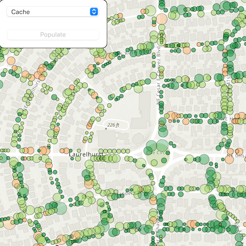

# Toggle between feature request modes

Use different feature request modes to populate the map from a service feature table.

## Use case

Feature tables can be initialized with a feature request mode which controls how frequently features are requested and locally cached in response to panning, zooming, selecting, or querying. The appropriate feature request mode can have implications on performance and should be determined based on considerations such as how often the data is expected to change or how often changes in the data should be reflected to the user.

* `OnInteractionCache` - fetches features within the current extent when needed (performing a pan or zoom) from the server and caches those features in a table on the client. Queries will be performed locally if the features are present, otherwise they will be requested from the server. This mode minimizes requests to the server and is useful for large batches of features which will change very infrequently.
* `OnInteractionNoCache` - always fetches features from the server and doesn't cache any features on the client. This mode is best for features which may changes often on the server or whose changes need to always be visible.
* `ManualCache` - only fetches features when explicitly populated from a query. This modes is best for features which change minimally or when it is not critical for the user to see the latest changes.

## How to use the sample

Choose a request mode from the combo box. Pan and zoom to see how the features update at different scales. If you choose ManualCache, click the "Populate" button to manually get a cache with a subset of features.

## How it works

1. Create a `ServiceFeatureTable` with the a feature service URL.
2. Create a `FeatureLayer` with the feature table and add it to a map's operational layers to display it.
3. Set the `FeatureRequestMode` property of the service feature table to the desired mode (`OnInteractionCache`, `OnInteractionNoCache`, or `ManualCache`).
    * If using `ManualCache`, populate the features with `ServiceFeatureTable::populateFromServiceAsync()`.

## Relevant API

* FeatureLayer
* FeatureRequestMode
* ServiceFeatureTable

## About the data

This sample uses the [Trees of Portland](https://services2.arcgis.com/ZQgQTuoyBrtmoGdP/arcgis/rest/services/Trees_of_Portland/FeatureServer/0) service showcasing over 200,000 street trees in Portland, OR. Each tree point models the health of the tree (green - better, red - worse) as well as the diameter of its trunk.

## Tags

cache, data, feature, feature request mode, performance

