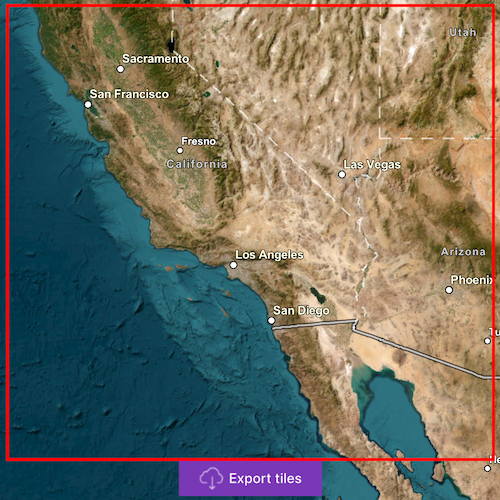

# Download raster tiles to local cache

Download tiles to a local tile cache file stored on the device.

## Use case

Field workers with limited network connectivity can use exported tiles as a basemap for use offline.

## How to use the sample

Pan and zoom into the desired area, making sure the area is within the red boundary. Click the 'Export tiles' button to start the process. On successful completion you will see a preview of the downloaded tile package.

## How it works

1. Create a map and set its `minScale` to 10,000,000. Limiting the scale in this sample limits the potential size of the selection area, thereby keeping the exported tile package to a reasonable size.
2. Create an `ExportTileCacheTask`, passing in the URI of the tiled layer.
3. Create default `ExportTileCacheParameters` for the task, specifying extent, minimum scale and maximum scale.
4. Use the parameters and a path to create an `ExportTileCacheJob` from the task.
5. Start the job, and when it completes successfully, get the resulting `TileCache`.
6. Use the tile cache to create an `ArcGISTiledLayer`, and display it in the map.

## Relevant API

* ArcGISTiledLayer
* ExportTileCacheJob
* ExportTileCacheParameters
* ExportTileCacheTask
* TileCache

## About the data

The sample uses a [World Ocean Base (for Export)](https://www.arcgis.com/home/item.html?id=5d85d897aee241f884158aa514954443) map service that features marine bathymetry. The service supports "estimate export tiles size" and "export tiles" operations.

## Additional information

ArcGIS tiled layers do not support reprojection, query, select, identify, or editing. See the [Layer types](https://developers.arcgis.com/qt/layers/#layer-types) discussion in the developers guide to learn more about the characteristics of ArcGIS tiled layers. The map service behind a tiled layer may support [Export Tiles](https://developers.arcgis.com/rest/services-reference/enterprise/export-tiles-map-service/) operation. You can also specify the maximum tiles clients will be allowed to download for the service.

## Tags

cache, download, offline
