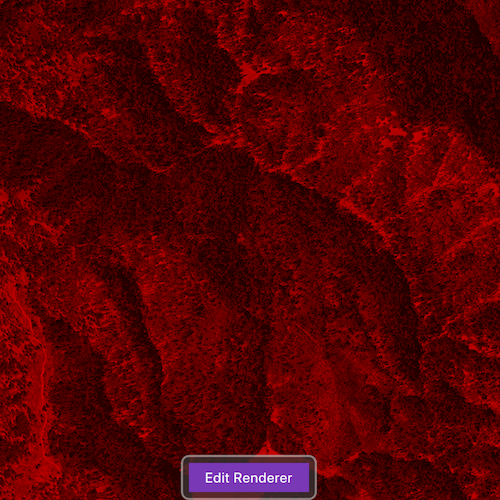

# RGB renderer

Apply an RGB renderer to a raster layer to enhance feature visibility.

## Use case

An RGB renderer is used to adjust the color bands of a multispectral image. Remote sensing images acquired from satellites often contain values representing the reflection of multiple spectrums of light. Changing the RGB renderer of such rasters can be used to differentiate and highlight particular features that reflect light differently, such as different vegetation types, or turbidity in water.

## How to use the sample

Tap on "Edit renderer" to change the settings for the rgb renderer. The sample allows you to change the stretch type and the parameters for each type. You can tap on the "Render" button to update the raster.

# How it works

1. Create a `Raster` from a from a multispectral raster file.
2. Create a `RasterLayer` from the raster.
3. Create a `Basemap` from the raster layer and set it to the map.
4. Create an `RGBRenderer`, specifying the `StretchParameters` and other properties.
5. Set the `Renderer` on the raster layer with `rasterLayer::setRenderer(renderer)`.

## Relevant API

* Basemap
* Raster
* RasterLayer
* RGBRenderer
* StretchParameters

## Offline Data

Read more about how to set up the sample's offline data [here](http://links.esri.com/ArcGISRuntimeQtSamples#use-offline-data-in-the-samples).

Link | Local Location
---------|-------|
|[Shasta.tif raster](https://www.arcgis.com/home/item.html?id=c669445e6cb4490b8306f0c170a9cbb1)| `<userhome>`/ArcGIS/Runtime/Data/raster/Shasta.tif |

## About the data

The raster used in this sample shows an area in the south of the Shasta-Trinity National Forest, California.

## Tags

analysis, color, composite, imagery, multiband, multispectral, pan-sharpen, photograph, raster, spectrum, stretch, visualization
