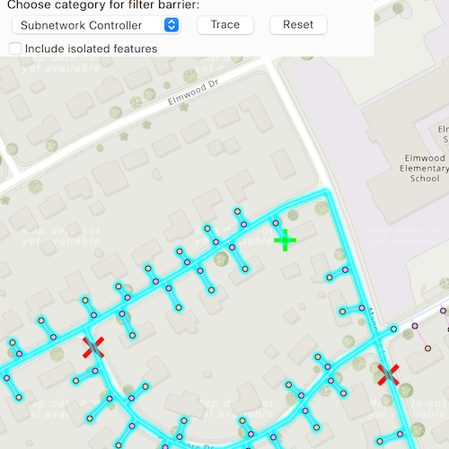

# Perform valve isolation trace

Run a filtered trace to locate operable features that will isolate an area from the flow of network resources.

## Use case

Determine the set of operable features required to stop a network's resource, effectively isolating an area of the network. For example, you can choose to return only accessible and operable valves: ones that are not paved over or rusted shut.

## How to use the sample

Select one or more features to use as filter barriers or create and set the configuration's filter barriers by selecting a category. Check or uncheck 'Include isolated features'. Press 'Trace' to run a subnetwork-based isolation trace. Press 'Reset' to clear filter barriers.

## How it works

1. Create a `MapView` and connect to its `mouseClicked` signal.
2. Create and load a `ServiceGeodatabase` with a feature service URL and get tables with their layer IDs.
3. Create a `Map` that contains `FeatureLayer`(s) created from the `ServiceGeodatabase`'s tables.
4. Create and load a `UtilityNetwork` with the feature service URL and the `Map`.
5. Add a `GraphicsOverlay` with a `Graphic` that represents the starting location, and another graphics overlay for the filter barriers.
6. Populate the list of filter barrier categories from `UtilityNetworkDefinition::categories`.
7. When the map view is clicked, identify which features are at that location and add a graphic that represents a filter barrier.
8. Create a `UtilityElement` for the identified feature and add this utility element to a list of filter barriers.
   - If the element is a junction with more than one terminal, display a terminal picker. Then set the junction's `terminal` property with the selected terminal.
   - If an edge, set its `fractionAlongEdge` property using `GeometryEngine::fractionAlong`.
9. When "Trace" is pressed:
   - Create `UtilityTraceParameters` with `UtilityTraceType::Isolation` and a starting location from a given asset type and global ID.
   - Set the `UtilityTraceParameters::traceConfiguration` property from a default `UtilityTraceConfiguration`. Set the `filter` property with an `UtilityTraceFilter` object.
10. If 'Trace' is clicked without filter barriers:
   - Create a new `UtilityCategoryComparison` with the selected category and `UtilityCategoryComparisonOperator::Exists`.
   - Create a new `UtilityTraceFilter` with this condition as `Barriers` to set `Filter` and update `IncludeIsolatedFeatures` properties of the default configuration from step 5.
   - Run `UtilityNetwork::trace`.
11. If `Trace` is clicked with filter barriers:
   - Update `IncludeIsolatedFeatures` property of the default configuration from step 5.
   - Run `UtilityNetwork::trace`.
12.  For every `FeatureLayer` in the map, select the features returned by `featuresForElementsAsync` from the elements matching their `NetworkSource::name` with the layer's `FeatureTable::name`.

## Relevant API

* GeometryEngine::fractionAlong
* ServiceGeodatabase
* UtilityCategory
* UtilityCategoryComparison
* UtilityCategoryComparisonOperator
* UtilityDomainNetwork
* UtilityElement
* UtilityElementTraceResult
* UtilityNetwork
* UtilityNetworkDefinition
* UtilityTerminal
* UtilityTier
* UtilityTraceFilter
* UtilityTraceParameters
* UtilityTraceResult
* UtilityTraceType

## About the data

The [Naperville gas](https://sampleserver7.arcgisonline.com/server/rest/services/UtilityNetwork/NapervilleGas/FeatureServer) network feature service, hosted on ArcGIS Online (authentication required: this is handled within the sample code), contains a utility network used to run the isolation trace shown in this sample.

## Additional information

Using utility network on ArcGIS Enterprise 10.8 requires an ArcGIS Enterprise member account licensed with the [Utility Network user type extension](https://enterprise.arcgis.com/en/portal/latest/administer/windows/license-user-type-extensions.htm#ESRI_SECTION1_41D78AD9691B42E0A8C227C113C0C0BF). Please refer to the [utility network services documentation](https://enterprise.arcgis.com/en/server/latest/publish-services/windows/utility-network-services.htm).

Credentials:
* Username: viewer01
* Password: I68VGU^nMurF

## Tags

category comparison, condition barriers, filter barriers, isolated features, network analysis, subnetwork trace, trace configuration, trace filter, utility network
